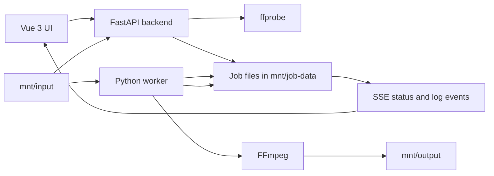

# Video Cleaner Web

[](https://github.com/andzhik/media-cleaner/actions/workflows/ci.yml)

LAN-only web app for cleaning video libraries by preserving selected audio and subtitle streams. It lets you browse a configured input folder, inspect streams with `ffprobe`, choose exactly what to keep, and queue FFmpeg jobs that write cleaned files to a configured output folder.

## Features

- Browse media folders from a configured input root.
- Probe video files with `ffprobe` and show audio/subtitle streams.
- Select streams per file or apply language selections in batches.
- Queue FFmpeg jobs and follow progress with live Server-Sent Events.
- Keep API, worker, and media roots separated for a simple LAN setup.
- Run with Docker Compose or directly on Windows.

## Architecture



The backend and worker share only configured filesystem roots: `mnt/input`, `mnt/output`, and `mnt/job-data`. The backend validates requests, writes job metadata, and streams status/log updates to the UI. The worker watches the queue, maps selected audio/subtitle streams to FFmpeg arguments, and updates progress as files are processed.

## Running With Docker

Use Docker Compose to start the frontend, backend, and worker together.

```powershell
docker compose up --build
```

Then open [http://localhost:5173](http://localhost:5173).

By default Compose maps:

- `./mnt/input` as read-only source media.
- `./mnt/output` as writable processed output.
- `./mnt/job-data` as writable job state.

## Running Manually On Windows

For running the three services directly on Windows PowerShell:

```powershell
.\run_all.bat
```

Install dependencies first as described in [MANUAL_RUN.md](MANUAL_RUN.md). The frontend runs on `:5173`, the backend API on `:8000`, and the worker runs as a separate Python process.

## Development

```powershell
.\run_lint.bat
.\run_tests.bat
```

See [TESTS.md](TESTS.md) for layer-specific commands and useful pytest flags. GitHub Actions runs Python linting, backend tests, worker tests, frontend linting, and frontend tests.

## API

See [API.md](API.md) for endpoint details. The main flow is:

1. `GET /api/tree` to load the input folder tree.
2. `GET /api/list?dir=/path` to list videos and probe streams.
3. `POST /api/process` to queue a job with selected streams.
4. `GET /api/jobs/{job_id}/events` to stream live status and logs.

## Demo Media

For demos and smoke tests, the app works well with small generated fixtures or openly licensed sample films. Public sources include Blender Open Movie projects such as [Big Buck Bunny](https://peach.blender.org/), [Sintel](https://durian.blender.org/), and [Tears of Steel](https://mango.blender.org/).

Example demo layout:

- `mnt/input/movies/demo-movie-01.mkv`
- `mnt/input/tv/sample-show/s01e01.mkv`
- `mnt/output/`

## Security Model

This is a LAN-only utility with no authentication by design. Media access is intentionally scoped to configured roots:

- Input files are read from `INPUT_ROOT`.
- Processed files are written under `OUTPUT_ROOT`.
- Job metadata is stored under `JOB_DATA_ROOT`.

Do not expose the service directly to the internet.

## Project Structure

- `frontend/`: Vue 3, TypeScript, Vite, PrimeVue UI.
- `backend/`: FastAPI API for file exploration, stream probing, and job management.
- `worker/`: Python FFmpeg job runner.
- `mnt/`: Shared local input, output, and job-data folders.
